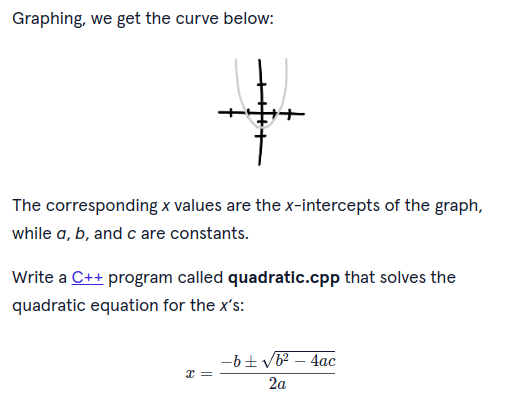

# Basic C++ Excercises for Uni

Basic C++ equations for the diploma in Software Development - Development Principles

## Dog Years

Simple program to convert dogs age from its current age to equivilent in Human years.

## Currency Simple

Simple Excercise to convert 3 South American Currencies to USD

## Quadratic 

Simple program to solve for the quadratic equation:

## Leap Year

Program to calculate leap years.

## Excer-1

Exercise 1 from worksheet, program to solve for:
"Z = ax + (b-c)(c-d)/y"

## Excer-2

Smallest number from 3 user inputs.

## Excer-3

